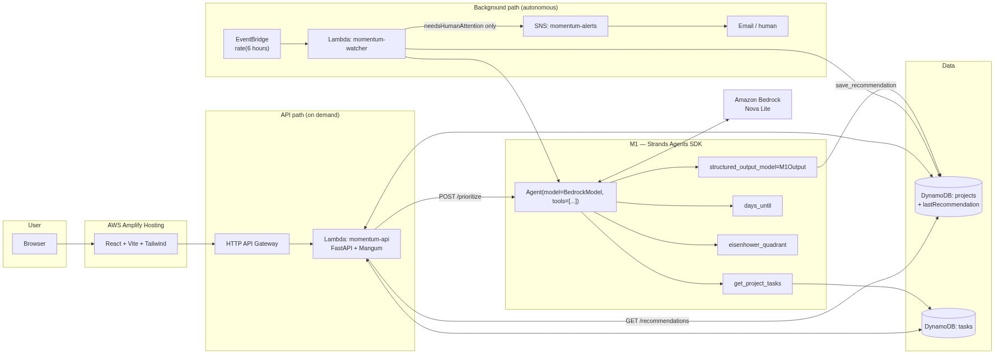

# Momentum

**Turn priorities into progress.**

[](LICENSE)
[](https://strandsagents.com)
[](https://aws.amazon.com/bedrock/)

> **AWS "Agents for Humans" Hackathon — Everyday Agents track.**
> Submission notes, pitch and checklist: [`SUBMISSION.md`](SUBMISSION.md).

Momentum is an autonomous project-prioritization agent. Unlike a task manager,
it decides *what you should work on next* — and it keeps deciding while you're
not looking.

**M1 (Momentum Intelligence)** is a [Strands Agents](https://strandsagents.com)
agent running on Amazon Bedrock. It reads your projects, deadlines, task
descriptions and completed work, calls tools to reason about time pressure,
and returns ranked, explained recommendations.

M1 runs in two modes:

| Mode | Trigger | What happens |
|------|---------|--------------|
| **On demand** | `POST /api/projects/{id}/prioritize` (the "Ask M1" button) | Ranked Eisenhower-matrix plan with reasons and next actions |
| **Background watcher** | EventBridge schedule (default every 6 h) | Re-plans every project silently; **only emails you when a deadline is at real risk** |

No new chore to babysit: the plan is always fresh in the app, and your inbox
only hears from M1 when a human decision is actually needed.

## Live

| Service | URL |
|---------|-----|
| Frontend | https://dev.d2kyovkps8f1nm.amplifyapp.com |
| API | https://3a9xfn5st8.execute-api.us-east-1.amazonaws.com |

## Architecture



```
React (Vite + TypeScript + Tailwind) → Amplify Hosting
  → HTTP API Gateway → Lambda (FastAPI + Mangum)
        └─► M1 Strands Agent ──► Amazon Bedrock (Nova Lite)
              tools: get_project_tasks · days_until · eisenhower_quadrant
              output: structured M1Output (Pydantic)
EventBridge rate(6h) → Lambda (watcher) → same M1 agent
        └─► DynamoDB.lastRecommendation   (always)
        └─► SNS → email                   (only if needsHumanAttention)
```

Full write-up with Mermaid source: [`docs/ARCHITECTURE.md`](docs/ARCHITECTURE.md).

## How the agent is built

```python
# backend/app/agent/m1.py
agent = Agent(
    name="M1",
    model=BedrockModel(model_id="amazon.nova-lite-v1:0", temperature=0.2),
    system_prompt=SYSTEM_PROMPT,
    tools=[get_project_tasks, days_until, eisenhower_quadrant],
)
result = agent(prompt, structured_output_model=M1Output)
result.structured_output.needsHumanAttention  # -> watcher decides whether to ping you
```

## Tech Stack

**Frontend:** React 19, TypeScript, Vite, Tailwind CSS v4, shadcn/ui, React Query, React Hook Form, Zod

**Backend:** Python 3.12, FastAPI, Pydantic, boto3, Mangum

**Agent:** Strands Agents SDK (`Agent`, `BedrockModel`, `@tool`, structured output) on Amazon Bedrock (Nova Lite)

**Infrastructure:** Terraform, DynamoDB (PAY_PER_REQUEST), Lambda ARM64, API Gateway v2, EventBridge, SNS, CloudWatch, Amplify

**CI/CD:** GitHub Actions (lint → test → validate → deploy)

## Local Development

### Frontend

```bash
cd frontend
npm install
npm run dev          # http://localhost:5173
```

### Backend

```bash
cd backend
python3.12 -m venv .venv
source .venv/bin/activate
pip install -e ".[dev]"
cp .env.example .env
uvicorn app.main:app --reload --port 8000
```

The backend needs AWS credentials with Bedrock + DynamoDB access
(`aws configure` or `AWS_PROFILE`). Run the background sweep locally with:

```bash
python -c "from app.agent.watcher import run_watch; print(run_watch())"
```

### Run Tests

```bash
# Backend (33 tests, agent + Bedrock mocked)
cd backend && source .venv/bin/activate
pytest tests/ -v

# Frontend
cd frontend
npm run lint
npm run build
```

## API Endpoints

```
GET    /health
POST   /api/projects
GET    /api/projects
GET    /api/projects/{id}
PATCH  /api/projects/{id}
DELETE /api/projects/{id}
POST   /api/projects/{id}/tasks
GET    /api/projects/{id}/tasks
GET    /api/projects/{id}/tasks/{taskId}
PATCH  /api/projects/{id}/tasks/{taskId}
DELETE /api/projects/{id}/tasks/{taskId}
POST   /api/projects/{id}/prioritize        # run M1 now
GET    /api/projects/{id}/recommendations   # latest result (from button or watcher)
```

## Deploy

```bash
# One-command deploy (requires AWS credentials)
./scripts/deploy.sh dev <aws-profile>
```

Deploys the API Lambda, the watcher Lambda, the EventBridge schedule and the
SNS alert topic. Set `alert_email` in
`infrastructure/terraform/environments/dev/terraform.tfvars` to receive alerts.
Details: [`docs/DEPLOYMENT.md`](docs/DEPLOYMENT.md).

## M1 Prioritization

POST `/api/projects/{id}/prioritize` returns:

```json
{
  "projectId": "...",
  "recommendations": [
    {
      "taskId": "...",
      "title": "...",
      "priorityScore": 95,
      "quadrant": "urgent-important",
      "reason": "Why this task matters now",
      "nextAction": "Concrete next step",
      "dependencies": ["other-task-id"],
      "confidence": 0.92
    }
  ],
  "summary": "Brief prioritization overview",
  "needsHumanAttention": false,
  "attentionReason": null,
  "generatedAt": "2026-07-11T..."
}
```

## Project Structure

```
momentum-ai/
├── frontend/          # React + Vite + Tailwind
├── backend/
│   └── app/agent/     # M1 Strands agent, tools, background watcher
├── infrastructure/    # Terraform (modular)
├── scripts/           # Deploy/destroy helpers
├── docs/              # PRD, architecture, prompts
└── .github/           # CI/CD workflows
```

## License

[MIT](LICENSE)
