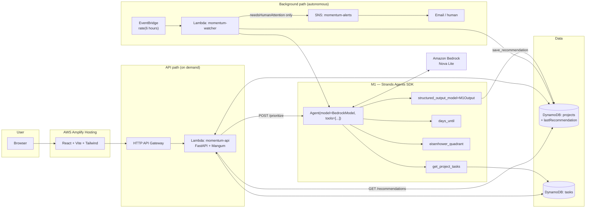

# Architecture

Momentum is two halves sharing one agent:

1. **On-demand** — a user opens a project and asks M1 "what should I do next?"
2. **Background** — the *watcher* re-runs M1 for every project on a schedule and
   only notifies a human when a deadline is genuinely at risk.

Both halves invoke the same Strands `Agent` (`backend/app/agent/m1.py`).

## Diagram



A rendered copy lives at `docs/architecture.png` for hackathon submission.

## Request flow — on demand

```
POST /api/projects/{id}/prioritize
  → get_project + list_tasks (DynamoDB)
  → build_context_prompt(project, tasks)
  → Agent(prompt, structured_output_model=M1Output)
       ↳ model may call days_until / eisenhower_quadrant / get_project_tasks
       ↳ Strands validates the final answer against the Pydantic schema
  → save_recommendation → projects.lastRecommendation
  → 200 PrioritizationResponse
```

## Request flow — background watcher

```
EventBridge (rate) → Lambda app.agent.watcher.handler
  for project in list_projects():
      skip if no active tasks
      output = run_m1(project, tasks)
      save_recommendation(...)
      if output.needsHumanAttention:
          SNS.publish(subject="[Momentum] <project> needs your attention")
```

The agent decides `needsHumanAttention`; the system prompt tells it to flip
the flag only for overdue or critically-close deadlines on work that has not
started. Everything else is written silently to DynamoDB, where the UI reads
it via `GET /api/projects/{id}/recommendations`.

## Components

| Layer | Tech | Notes |
|-------|------|-------|
| Frontend | React 19, Vite, Tailwind v4, shadcn/ui, React Query | Hosted on Amplify |
| API | FastAPI + Mangum on Lambda (Python 3.12, ARM64) | HTTP API Gateway v2 |
| Agent | **Strands Agents SDK** `Agent` + `BedrockModel` + `@tool` | Structured output via Pydantic |
| Model | Amazon Bedrock — Nova Lite | Swap via `BEDROCK_MODEL_ID` |
| Background | EventBridge rule → watcher Lambda → SNS | Schedule via `watcher_schedule` |
| Data | DynamoDB `projects`, `tasks` (PAY_PER_REQUEST) | Recommendation cached on project item |
| Infra | Terraform (modular), GitHub Actions OIDC deploy | `infrastructure/terraform` |

## Why Strands

- **Tools instead of prompt arithmetic** — the model calls `days_until` rather
  than guessing dates, which was the main source of wrong urgency.
- **Structured output** — `structured_output_model=M1Output` replaces hand-rolled
  JSON scraping and gives a typed, validated result in one line.
- **One agent, two triggers** — the same `create_m1_agent()` powers the HTTP
  endpoint and the scheduled sweep.
- **Portable** — the same code runs locally, in Lambda, or on AgentCore Runtime
  (see `docs/DEPLOYMENT.md`).
